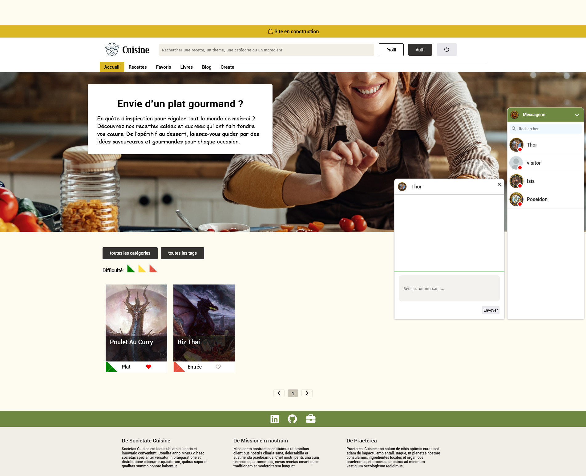
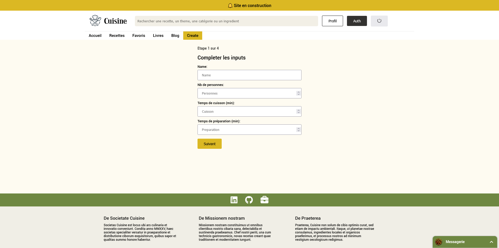
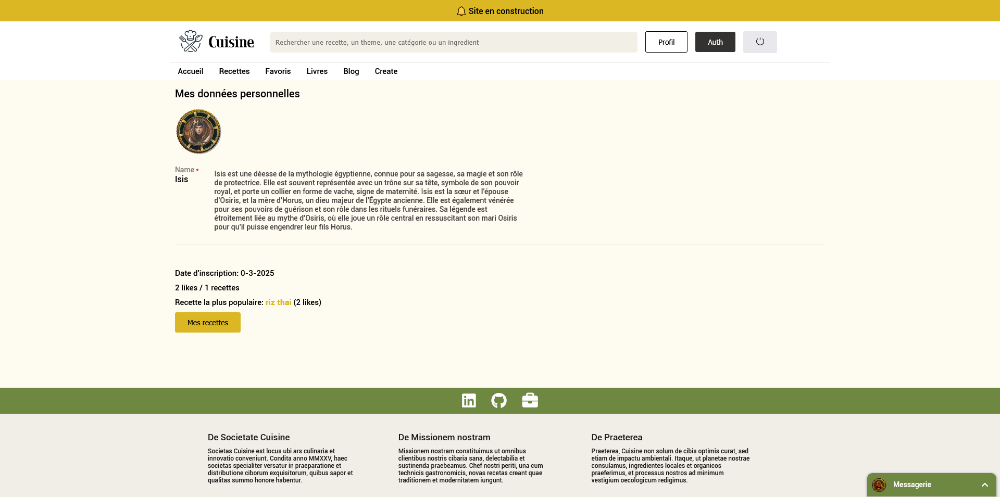

# Cuisine

## Site de recherche de cuisine
 
  
    

## Technos :

## Description:
Application culinaire qui utilise react (vite), nodejs (express) et mySql. 
Pagination (url) 
Chat (socket.io) 
Authentification (regex, token et cookie http only) 
Etat centralisé (context)  
Recherche et trie (SQL)  
Architecture modulaire et composants réutilisables  
Api restfull  

## URL :
> https://cuisine-khaki.vercel.app

## TABLES SQL :
/back/sql_tables

## Variables d'environnement:
> Créer un fichier .env dans le dossier back . 
PORT="1892" 
_HOST="localhost" 
_USER="root" 
_PASSWORD="" 
_DATABASE="cuisine" 
_SECRET_KEY="shiufhdsifd4g56df4g68df4g5fg4hh4@@fhfgh5fgh746d8fgh4d6f854h6f5dghfghfhdfgUGJHUKGhk5lhjk7" 
MAGIC_WORD="s4g8548g4fd6hg478fj85g4hj3584f4sdf65s4fsdf@fsdfsd4f57sdf4sgb3j5b7fj435g4jk85b@@@4583k45h834jk5382j4j573i4ghjkv23fg54kb53gh4vjk32vc4SDFSDFdffh532k4vg532k4f235g4k532g4k5g2f3jh1" 
NODE_ENV="production" 
FRONT_HOST="http://127.0.0.1:3000" 

### Installer node.js

### Ajouter variables d'environnement dans un fichier .env

### Installer les dépendances:

`npm install`

### Créer la base de donnée ainsi que les tables (cf path)

### Indiquer le host backend dans le fichier front>src>host

### Indiquer le Host frontend dans les fichiers back>app & back>server

### Lancer le serveur:

`node server`

### Lancer l'application:

`npm run dev`
